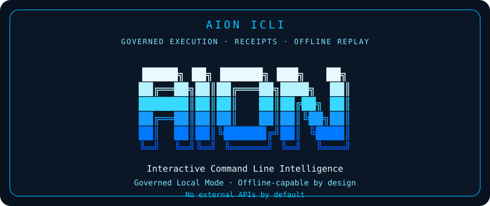

# ⚡ AION ICLI — Governed Command Line Intelligence

<p align="center">
  <strong>Governed Execution · Receipts · Offline Replay</strong>
</p>

<p align="center">
  
  
  
  
  
  
</p>

<p align="center">
  <a href="#quick-start---windows">Quick Start</a> ·
  <a href="#guided-tour">Guided Tour</a> ·
  <a href="#local-governance-proxy">Governance Proxy</a> ·
  <a href="#public-safety-boundary">Safety Boundary</a> ·
  <a href="docs/PUBLIC_RELEASE_LOCK_V1.md">Release Lock</a>
</p>

<p align="center">
  
</p>


**AION ICLI** is a local-first command-line interface for governed AI and system actions.

It helps users evaluate requests, expose boundaries, and produce receipts before trust is granted.

If you want a CLI that makes AI/system actions more inspectable, constrained, and replayable, this is the front door.


## Demo: Your agent said it was done. AION proved whether it was admissible.

Problem: agents can claim completion without admissible local evidence.

AION answer: run a local proof gate that checks claims against artifacts and returns governed decisions.

Run:

```powershell
powershell -NoProfile -ExecutionPolicy Bypass -File .\scripts\RUN_AGENT_CLAIM_PROOF_GATE_DEMO_V1.ps1
```

Expected decisions:

- PASS
- WARN
- BLOCK

Output paths:

- `demo\agent-claim-proof-gate\output\agent_claim_proof_gate_results_v1.json`
- `demo\agent-claim-proof-gate\output\agent_claim_proof_gate_results_v1.md`

Verify:

```powershell
powershell -NoProfile -ExecutionPolicy Bypass -File .\scripts\VERIFY_AGENT_CLAIM_PROOF_GATE_DEMO_V1.ps1
```

Expected marker:

- `AION_AGENT_CLAIM_PROOF_GATE_DEMO_V1_VERIFY_OK`

Fresh-clone acceptance is verified by `scripts\VERIFY_PUBLIC_DEMO_FRESH_CLONE_ACCEPTANCE_V1.ps1`.


## Public Demo Release Pack

- ZIP: `dist\aion-public-demo-release-pack-v1.zip`
- SHA256: `54FFBD4E701820BEAC261D0043FA67705F90C79EF48AC115B81174535BC7009B`

Verify:

```powershell
powershell -NoProfile -ExecutionPolicy Bypass -File .\scripts\VERIFY_PUBLIC_DEMO_RELEASE_PACK_V1.ps1
```

Expected marker:

- `AION_PUBLIC_DEMO_RELEASE_PACK_V1_VERIFY_OK`

## Evaluate API Adapter V1

Programmatic local governance endpoint for external detectors (for example BuzzShield):

- `POST http://127.0.0.1:8765/evaluate`
- `GET http://127.0.0.1:8765/health`

See: [AION Evaluate API Adapter V1](docs/AION_EVALUATE_API_V1.md)

## Documentation Map

Use these links to jump directly into the public AION ICLI release:

| Area | Link | What it shows |
|---|---|---|
| Start here | [Guided Tour](docs/REPO_GUIDED_TOUR_V1.md) | Basic usage and repo walkthrough |
| Public boundary | [Public Boundary](docs/PUBLIC_BOUNDARY.md) | What this public repo includes and excludes |
| Hardening | [Hardening Note](docs/HARDENING_NOTE_V1.md) | Public-safety posture |
| Release lock | [Public Release Lock](docs/PUBLIC_RELEASE_LOCK_V1.md) | Locked public release baseline |
| Release notes | [Release Notes V1](docs/RELEASE_NOTES_V1.md) | What Public Release V1 includes |
| Connector policy | [Connector Policy V2](docs/CONNECTOR_POLICY_V2.md) | Rules for SDK/API/model connectors |
| Governance proxy | [Local Governance Proxy V1](docs/LOCAL_GOVERNANCE_PROXY_V1.md) | Local governance demo |
| SDK contract | [Connector SDK Contract V1](docs/CONNECTOR_SDK_CONTRACT_V1.md) | Request/response contract shape |
| API adapter | [Safe API Adapter Dry-Run V1](docs/SAFE_API_ADAPTER_DRY_RUN_V1.md) | API review without live API calls |
| Evaluate adapter | [AION Evaluate API Adapter V1](docs/AION_EVALUATE_API_V1.md) | Local HTTP governance adapter for machine-to-machine evaluate requests |
| Preflight gate | [AION Preflight Gate V1](docs/AION_PREFLIGHT_GATE_V1.md) | Pre-execution governance for proposed actions before consequence |
| Memory scars | [AION Memory Scars V1](docs/AION_MEMORY_SCARS_V1.md) | Public-safe failure memory that biases governance decisions away from repeated mistakes |
| Preflight + memory | [AION Preflight + Memory Integration V1](docs/AION_PREFLIGHT_MEMORY_INTEGRATION_V1.md) | Preflight decisions influenced by public-safe failure memory |
| Sentinel + contradiction | [AION Sentinel + Contradiction V1](docs/AION_SENTINEL_CONTRADICTION_V1.md) | Detects claim/evidence mismatch before trust and maps contradictions to governed decisions |
| Introspection engine | [AION Introspection Engine V1](docs/AION_INTROSPECTION_ENGINE_V1.md) | Living proof graph of proven capabilities, missing proof surfaces, and next build pointer |
| Self-repair planner | [AION Self-Repair Planner V1](docs/AION_SELF_REPAIR_PLANNER_V1.md) | Plan-only repair paths for missing controls, contradictions, and evidence/proof gaps |
| Self-patching sandbox | [AION Self-Patching Sandbox V1](docs/AION_SELF_PATCHING_SANDBOX_V1.md) | Sandbox-only patch proposals with rollback proof and dry-run validation, no production mutation |
| Domain governors | [AION Domain Governors V1](docs/AION_DOMAIN_GOVERNORS_V1.md) | Mini AION governors for agent, wallet, security, trading, quantum, and physical AI domains |
| Creativity + intuition | [AION Creativity + Intuition V1](docs/AION_CREATIVITY_INTUITION_V1.md) | Heuristic signal scoring and bounded next-action generation for safer governance follow-up |
| Demo orchestrator | [AION Demo Orchestrator V1](docs/AION_DEMO_ORCHESTRATOR_V1.md) | One-command public-safe proof of the full AION governance chain end-to-end |
| Public demo recording pack | [AION Public Demo Recording Pack V1](docs/AION_PUBLIC_DEMO_RECORDING_PACK_V1.md) | Deterministic video recording guide and script for the final public-safe AION demo |
| Living voice adapter | [AION Living Voice Adapter V1](docs/AION_LIVING_VOICE_ADAPTER_V1.md) | Continuity-driven conversational intelligence adapter with truth-first governance constraints |
| Living intelligence kernel | [AION Living Intelligence Kernel V1](docs/AION_LIVING_INTELLIGENCE_KERNEL_V1.md) | Continuity-driven deep analysis kernel: intent, contradictions, assumptions, counterfactuals, and next-admissible move |
| Dynamic cognition engine | [AION Dynamic Cognition Engine V1](docs/AION_DYNAMIC_COGNITION_ENGINE_V1.md) | Recursive theory generation and contradiction-pressure framing to avoid repetitive governed response templates |
| Model adapter | [Safe Model Adapter Dry-Run V1](docs/SAFE_MODEL_ADAPTER_DRY_RUN_V1.md) | Model-provider review without provider calls |
| SDK examples | [SDK Examples V1](docs/SDK_EXAMPLES_V1.md) | Developer request examples and receipts |
| Voice layer | [Voice Layer V1](docs/VOICE_LAYER_V1.md) | Human-facing AION voice with optional diagnostics |
| Adaptive reasoning | [Adaptive Reasoning Layer V1](docs/ADAPTIVE_REASONING_LAYER_V1.md) | Signal-based operator responses from real prompt wording |
| Living proof graph | [Living Proof Graph V1](docs/LIVING_PROOF_GRAPH_V1.md) | Local relational proof memory across layers, verifiers, receipts, and roadmap state |
| Evidence engine | [Evidence Engine V1](docs/EVIDENCE_ENGINE_V1.md) | Admissibility scoring for claims, docs, verifiers, roadmap wiring, and release packaging |
| Introspection gate | [Introspection Gate V1](docs/INTROSPECTION_GATE_V1.md) | Self-audit before final output to prevent overclaim and boundary leaks |
| Contradiction engine | [Contradiction Engine V1](docs/CONTRADICTION_ENGINE_V1.md) | Detects roadmap/wiring/evidence/release mismatches and tracks accepted caveats |
| Self-repair planner | [Self-Repair Planner V1](docs/SELF_REPAIR_PLANNER_V1.md) | Review-only remediation plans for contradictions and evidence gaps |
| Sentinel consistency engine | [Sentinel Consistency Engine V1](docs/SENTINEL_CONSISTENCY_ENGINE_V1.md) | Local organism health monitor over roadmap, wiring, contradictions, evidence, and repair state |
| Offline bundle | [Offline AION CLI Bundle V1.1.0](docs/OFFLINE_AION_CLI_BUNDLE_V1_1_0.md) | Current offline bundle covering post-v1.0.0 intelligence layers and fresh-install proof |
| Agent claim proof gate demo | [Agent Claim Proof Gate Demo V1](docs/AGENT_CLAIM_PROOF_GATE_DEMO_V1.md) | Your agent said it was done. AION checks whether the claim is admissible against local evidence. |
| CLI proof | [Governed vs Ungoverned CLI Proof V1](docs/GOVERNED_VS_UNGOVERNED_CLI_PROOF_V1.md) | Difference between invisible trust and governed trust |
| Acceptance proof | [Connector Stack Acceptance Report V1](reports/CONNECTOR_STACK_ACCEPTANCE_REPORT_V1.md) | Fresh-clone proof of the full connector stack |


## What you can do with AION ICLI

AION ICLI gives users a simple way to place a governance layer in front of AI or system actions.

At this public stage, it runs locally and proves the pattern without requiring cloud keys, model credentials, or background services.

### 1. Ask AION what it is

    .\bin\aion.cmd "Who are you, AION?"

Example result:

    Boundary > LOCAL_ONLY
    Network  > NOT_USED
    Mutation > NOT_PERFORMED
    Receipt  > receipts\local\aion_cli_receipt_v1.json

Use this to confirm AION is running in local governed mode.

### 2. Check an action before trusting it

Instead of accepting an AI or automation suggestion blindly, AION ICLI shows the boundary around the action.

Example use case:

    A script wants to run.
    A user wants to know if it was evaluated locally.
    AION shows whether network, mutation, or external calls were used.

### 3. Produce a receipt

AION ICLI writes a local receipt for basic interactions.

Receipts help answer:

- what was requested
- what boundary was active
- whether a network was used
- whether mutation was performed
- where the evidence was written

### 4. Run an offline governance proxy demo

AION ICLI includes a deterministic SDK/governance proxy example.

Run:

    powershell -NoProfile -ExecutionPolicy Bypass -File .\scripts\VERIFY_LOCAL_GOVERNANCE_PROXY_V1.ps1

Example behavior:

    risk_hint=low  -> ALLOW
    risk_hint=high -> BLOCK
    missing hint   -> WARN

This demonstrates how future SDK, API, or model-mediated workflows can be checked before execution.

### 5. Keep generated outputs clean

Runtime outputs are written to:

    examples/governance/generated/

That folder is ignored by Git, so verification does not dirty the repository.

### 6. Verify the release

Run:

    powershell -NoProfile -ExecutionPolicy Bypass -File .\scripts\VERIFY_PUBLIC_RELEASE_LOCK_V1.ps1

Expected marker:

    AION_PUBLIC_RELEASE_LOCK_V1_VERIFY_OK


## What AION ICLI is

AION ICLI is a governed command-line interface designed to make execution safer, clearer, and more verifiable.

It is built around a simple operating rule:

    Do not trust an action just because it was suggested.
    Evaluate it, expose boundaries, produce a receipt, and make the proof visible.

AION ICLI can be used as a local governance surface for:

- AI assistants
- agent workflows
- SDK requests
- API actions
- automation previews
- local policy checks
- proof-oriented demos

By default, it runs locally and does not call external APIs.


## What AION ICLI is not

AION ICLI is not:

- a cloud AI provider
- a general-purpose AI model
- a live model provider
- a cloud AI service
- an autonomous agent
- a bounty engine
- a background automation service
- a replacement for independent security review

This repo contains the interface, examples, docs, schemas, and deterministic local governance demo needed to run AION ICLI.


## Why it exists

Modern AI systems often produce outputs without showing enough execution context.

AION ICLI demonstrates a different pattern:

    request -> boundary check -> decision -> receipt -> replayable proof

The goal is not to make the user blindly trust the interface.

The goal is to make the interface show:

- what it did
- what it did not do
- whether it used a network
- whether it mutated anything
- what receipt was created
- what boundary was enforced


## Quick Start - Windows

    git clone https://github.com/VerifywithAION/aion-icli.git
    cd aion-icli
    powershell -NoProfile -ExecutionPolicy Bypass -File .\install.ps1
    .\bin\aion.cmd "Who are you, AION?"

Expected markers:

    AION_ICLI_INSTALL_PREVIEW_OK
    AION ICLI
    Boundary > LOCAL_ONLY
    Network  > NOT_USED
    Mutation > NOT_PERFORMED

---

## Quick Start - macOS/Linux

    git clone https://github.com/VerifywithAION/aion-icli.git
    cd aion-icli
    sh ./install.sh
    sh ./bin/aion "Who are you, AION?"


## Guided Tour

### Step 1 - Run the CLI

Windows:

    .\bin\aion.cmd "Who are you, AION?"

PowerShell:

    powershell -NoProfile -ExecutionPolicy Bypass -File .\bin\aion.ps1 "Who are you, AION?"

macOS/Linux:

    sh ./bin/aion "Who are you, AION?"


### Step 2 - Read the banner

You should see:

    AION ICLI
    Interactive Command Line Intelligence
    Governed Local Mode
    Offline-capable by design
    No external APIs by default

This means the public interface is running in local governed mode.


### Step 3 - Observe the offline capability block

AION ICLI should show:

    What I can do offline:
    - Answer from local rules and local project context
    - Evaluate actions before execution
    - Produce receipts and proof traces
    - Block unsafe or unproven operations
    - Preserve evidence for replay and audit


### Step 4 - Inspect the boundary output

Every basic interaction should expose the boundary:

    Boundary > LOCAL_ONLY
    Network  > NOT_USED
    Mutation > NOT_PERFORMED
    Receipt  > receipts\local\aion_cli_receipt_v1.json

This is the central behavior: AION ICLI tells you what happened and what did not happen.


### Step 5 - Run the public safety verifier

    powershell -NoProfile -ExecutionPolicy Bypass -File .\scripts\VERIFY_PUBLIC_SAFE.ps1

Expected marker:

    AION_ICLI_PUBLIC_SAFE_VERIFY_OK


### Step 6 - Run the local governance proxy demo

AION ICLI includes a deterministic offline SDK/governance proxy example.

It reads request JSON files and writes generated response/receipt outputs.

    powershell -NoProfile -ExecutionPolicy Bypass -File .\scripts\VERIFY_LOCAL_GOVERNANCE_PROXY_V1.ps1

Expected markers:

    AION_LOCAL_GOVERNANCE_PROXY_V1_DEMO_OK
    AION_LOCAL_GOVERNANCE_PROXY_V1_VERIFY_OK

Generated outputs are written to:

    examples/governance/generated/

That folder is ignored by Git so runtime verification does not dirty the repo.


### Step 7 - Verify the release lock

    powershell -NoProfile -ExecutionPolicy Bypass -File .\scripts\VERIFY_PUBLIC_RELEASE_LOCK_V1.ps1

Expected marker:

    AION_PUBLIC_RELEASE_LOCK_V1_VERIFY_OK


## Developers: connect to AION in 3 minutes

AION ICLI exposes a public-safe connector pattern for apps, SDKs, API clients, model request envelopes, and automation tools.

The public contract is simple:

    request JSON -> local AION review -> human-friendly result -> receipt

No live API call is made by default. No model provider is called by default. No secret is required.

### 1. Try the local governance proxy

    powershell -NoProfile -ExecutionPolicy Bypass -File .\scripts\VERIFY_LOCAL_GOVERNANCE_PROXY_V1.ps1

Expected marker:

    AION_LOCAL_GOVERNANCE_PROXY_V1_VERIFY_OK

### 2. Try the safe API adapter dry-run

    powershell -NoProfile -ExecutionPolicy Bypass -File .\scripts\VERIFY_SAFE_API_ADAPTER_DRY_RUN_V1.ps1

Expected marker:

    AION_SAFE_API_ADAPTER_DRY_RUN_V1_VERIFY_OK

What it proves:

- API-style requests can be reviewed before execution
- network remains unused
- live API calls remain unperformed
- receipts are generated locally

### 3. Try the safe model adapter dry-run

    powershell -NoProfile -ExecutionPolicy Bypass -File .\scripts\VERIFY_SAFE_MODEL_ADAPTER_DRY_RUN_V1.ps1

Expected marker:

    AION_SAFE_MODEL_ADAPTER_DRY_RUN_V1_VERIFY_OK

What it proves:

- model request envelopes can be reviewed before provider execution
- no provider is called
- no model is called
- no network is used
- receipts are generated locally

### 4. Try the SDK examples

    powershell -NoProfile -ExecutionPolicy Bypass -File .\scripts\VERIFY_SDK_EXAMPLES_V1.ps1

Expected marker:

    AION_SDK_EXAMPLES_V1_VERIFY_OK

What it proves:

- developers can send SDK-style request JSON
- AION reviews it locally
- AION returns a human-friendly governance result
- generated receipts stay ignored by Git

### 5. Run the full connector proof

See the public proof report:

    [Connector Stack Acceptance Report V1](reports/CONNECTOR_STACK_ACCEPTANCE_REPORT_V1.md)

Fresh-clone acceptance marker:

    AION_ICLI_CONNECTOR_STACK_ACCEPTANCE_TEST_V1_PASS


## Local Governance Proxy

The Local Governance Proxy V1 is the public-safe foundation for future SDK/API/model adapter governance.

It does not call external services.

It uses deterministic example request files:

    examples/governance/sdk_request_allow.json
    examples/governance/sdk_request_block.json

It generates responses and receipts into:

    examples/governance/generated/

The demo behavior is intentionally simple:

    risk_hint=low  -> ALLOW
    risk_hint=high -> BLOCK
    missing hint   -> WARN

This proves the governance pattern using a transparent public demo.


## Public Safety Boundary

This repository may contain:

- CLI launchers
- local CLI entrypoint
- guided docs
- public schemas
- public examples
- deterministic offline governance proxy
- public-safe verification scripts
- sample receipts

This repository must not contain:

- unrelated backend service code
- confidential documents
- hidden automatic execution logic
- undocumented decision behavior
- live model routing logic
- real provider API keys
- secrets or tokens
- secrets, tokens, or credentials
- exploit automation


## Current release status

Latest locked public release:

    f9ce424 Lock AION ICLI Public Release v1

Validated stack:

    3b13c25 Initial public-safe AION ICLI release
    0420c7e Add AION ICLI Local Governance Proxy v1
    2002b85 Keep governance proxy outputs generated and untracked
    f9ce424 Lock AION ICLI Public Release v1

Fresh clone validation proved:

    AION_ICLI_INSTALL_PREVIEW_OK
    AION_ICLI_PUBLIC_SAFE_VERIFY_OK
    AION_LOCAL_GOVERNANCE_PROXY_V1_DEMO_OK
    AION_LOCAL_GOVERNANCE_PROXY_V1_VERIFY_OK
    AION_ICLI_FRESH_CLONE_CLEANLINESS_TEST_V3_PASS


## Future direction

AION ICLI is designed to become a universal governance surface for AI systems, API actions, SDK calls, and model-mediated workflows.

Future connector layers must remain:

- explicit opt-in
- provider-neutral
- no secrets committed
- receipt-bound
- locally verifiable
- governed before execution
- safe by default


## Read next

Start here:

- [Public Boundary](docs/PUBLIC_BOUNDARY.md)
- [Hardening Note V1](docs/HARDENING_NOTE_V1.md)
- [Repo Guided Tour V1](docs/REPO_GUIDED_TOUR_V1.md)
- [Connector SDK Contract V1](docs/CONNECTOR_SDK_CONTRACT_V1.md)
- [Connector Policy V2](docs/CONNECTOR_POLICY_V2.md)
- [Safe API Adapter Dry-Run V1](docs/SAFE_API_ADAPTER_DRY_RUN_V1.md)
- [Safe Model Adapter Dry-Run V1](docs/SAFE_MODEL_ADAPTER_DRY_RUN_V1.md)
- [SDK Examples V1](docs/SDK_EXAMPLES_V1.md)
- [Local Governance Proxy V1](docs/LOCAL_GOVERNANCE_PROXY_V1.md)
- [Public Release Lock V1](docs/PUBLIC_RELEASE_LOCK_V1.md)
- [Release Notes V1](docs/RELEASE_NOTES_V1.md)
- [Connector Stack Acceptance Report V1](reports/CONNECTOR_STACK_ACCEPTANCE_REPORT_V1.md)
- [Public Install Package V1](docs/PUBLIC_INSTALL_PACKAGE_V1.md)
- [User Guide V1](docs/USER_GUIDE_V1.md)
- [Interactive Mode V1](docs/INTERACTIVE_MODE_V1.md)
- [Capability Router V1](docs/CAPABILITY_ROUTER_V1.md)
- [GitHub Release V1 Draft](docs/GITHUB_RELEASE_V1_DRAFT.md)


## Voice Layer V1

Default ICLI responses now use a human-facing AION operator voice.

- default mode: natural response + proof footer
- diagnostics mode: `diagnostics on|off|diagnostics`
- receipts remain machine-verifiable with capability/boundary/network/mutation/execution fields

## Adaptive Reasoning Layer V1

AION now composes responses from extracted prompt signals (subject, urgency, missing evidence, risk lens) instead of static canned text.

- default mode: natural adaptive operator response + proof footer
- diagnostics mode: shows capability and extracted signals
- receipts keep machine-verifiable routing and boundary fields


### Governance Brain Adapter V1

AION can inspect public-safe local repo artifacts (docs, reports, schemas, examples, packaging metadata, verifier names, and local receipt state) to answer from evidence while keeping local-only boundaries.


## Governance Brain Integration Fix V1

- [Governance Brain Integration Fix V1](docs/GOVERNANCE_BRAIN_INTEGRATION_FIX_V1.md)
- Ensures release-state questions use governance brain evidence in both normal and diagnostics mode, with accurate artifacts consulted and evidence summary.


## Memory Scar Engine V1

- [Memory Scar Engine V1](docs/MEMORY_SCAR_ENGINE_V1.md)
- AION learns from verifier failures, integration drift, missing evidence, and repair rules using public-safe local scar memory.


## Roadmap and Wiring State V1

- [AION ICLI Roadmap State V1](docs/AION_ICLI_ROADMAP_STATE_V1.md)
- [AION ICLI Next 8 Builds V1](docs/AION_ICLI_NEXT_8_BUILDS_V1.md)
- [AION ICLI System Wiring Report V1](docs/AION_ICLI_SYSTEM_WIRING_REPORT_V1.md)


## Artifact Inspection Runner V1

- [Artifact Inspection Runner V1](docs/ARTIFACT_INSPECTION_RUNNER_V1.md)
- AION can inspect repo-local artifacts in read-only mode and classify risk before trust; inspected artifacts are never executed.


## AION ICLI Release Evidence Index V1

Verifier:

.\scripts\VERIFY_AION_ICLI_RELEASE_EVIDENCE_INDEX_V1.ps1

Expected marker:

AION_ICLI_RELEASE_EVIDENCE_INDEX_V1_VERIFY_OK


## AION ICLI Proof Demo Pack V1

Proof demo pack:

.\proof_demo_pack\AION_ICLI_PROOF_DEMO_PACK_V1.json

Report:

.\proof_demo_pack\reports\AION_ICLI_PROOF_DEMO_PACK_V1_REPORT.md

Verifier:

.\scripts\VERIFY_AION_ICLI_PROOF_DEMO_PACK_V1.ps1

Markers:

AION_ICLI_PROOF_DEMO_PACK_V1_VERIFY_OK
AION_ICLI_PROOF_DEMO_PACK_V1_ROOT_VERIFY_OK

